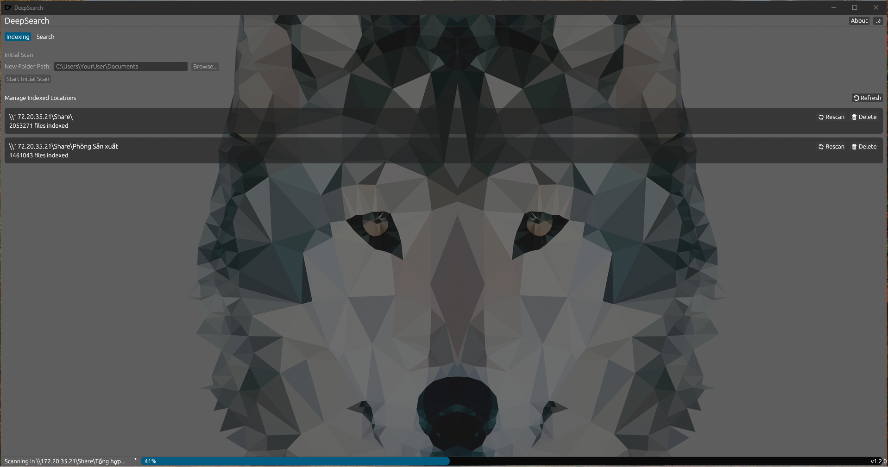

# DeepSearch

▐▀▀▀▀▀▀▀▀▀▀▀▀▀▀▀▀▀▀▀▀▀▀▀▀▀▀▀▀▀▀▀▀▀▀▀▀▀▀▀▀▀▀▀▀▀▀▀▀▀▀▀▀▀▀▀▀▀▀▀▀▀▀▀▀▀▀▀▀▀▀▀▀▀▀▀▀▀▀▀▀▀▀▀▀▀▀▌
▐*██████╗*███████╗███████╗██████╗*****███████╗███████╗*█████╗*██████╗**██████╗██╗**██╗*▌
▐*██╔══██╗██╔════╝██╔════╝██╔══██╗****██╔════╝██╔════╝██╔══██╗██╔══██╗██╔════╝██║**██║*▌
▐*██║**██║█████╗**█████╗**██████╔╝****███████╗█████╗**███████║██████╔╝██║*****███████║*▌
▐*██║**██║██╔══╝**██╔══╝**██╔═══╝*****╚════██║██╔══╝**██╔══██║██╔══██╗██║*****██╔══██║*▌
▐*██████╔╝███████╗███████╗██║*********███████║███████╗██║**██║██║**██║╚██████╗██║**██║*▌
▐*╚═════╝*╚══════╝╚══════╝╚═╝*********╚══════╝╚══════╝╚═╝**╚═╝╚═╝**╚═╝*╚═════╝╚═╝**╚═╝*▌
▐▄▄▄▄▄▄▄▄▄▄▄▄▄▄▄▄▄▄▄▄▄▄▄▄▄▄▄▄▄▄▄▄▄▄▄▄▄▄▄▄▄▄▄▄▄▄▄▄▄▄▄▄▄▄▄▄▄▄▄▄▄▄▄▄▄▄▄▄▄▄▄▄▄▄▄▄▄▄▄▄▄▄▄▄▄▄▌

**DeepSearch** is a high-performance, cross-platform file indexing and search utility developed in Rust.  
It builds a fast, searchable index of your local folders and network shared directories, allowing for near-instantaneous file name lookups.

[**Source Code on GitHub**](https://github.com/dohuyhoang93/DeepSearch)

---

## Features

- **Modern & Responsive GUI**: A clean and intuitive graphical user interface built with `eframe` (egui).
- **Light & Dark Modes**: Toggle between light and dark themes to suit your preference.
- **Persistent Indexing**: Uses a local `redb` database to store file indexes, allowing for fast subsequent searches without needing to re-scan entire directories.
- **Incremental Updates**: A "Rescan" feature efficiently rebuilds the index for a location in the background. Once complete, it atomically swaps the old index for the new one, ensuring data consistency and high performance.
- **Optimized for Performance**: Leverages Rust’s concurrency model (`rayon`) for both indexing and searching to maximize throughput and keep the UI responsive.
- **Intelligent Search**: File name search is insensitive to case and diacritics (e.g., `thanh` will match `Thành`).
- **Cross-Platform**: Runs on Windows, macOS, and Linux.

---

## Interface Preview

The application is organized into two main tabs:

1.  **Indexing Tab**: For adding new folders to the index and managing existing ones (rescan, delete).
2.  **Search Tab**: For performing searches across one or more indexed locations.

A status bar at the bottom provides feedback on current operations and shows a progress bar for long-running tasks.




---

## Usage Guide

### 1. Indexing a New Folder

This is the first step for any new directory you want to make searchable.

1.  Launch the application.
2.  On the **Indexing** tab, find the "Initial Scan" section.
3.  Click **"Browse..."** to pick a folder, or paste the full path directly into the "New Folder Path" text field (e.g., `C:\Users\YourName\Documents` or `\\server\share`).
4.  Click **"Start Initial Scan"**. 
5.  The status bar will show the scanning progress. Once complete, the new location will appear in the "Manage Indexed Locations" list.

### 2. Searching the Index

Once one or more directories have been indexed, you can search them.

1.  Switch to the **Search** tab.
2.  In the left-hand "Search In:" panel, check the boxes for the locations you want to search within.
3.  Type your query into the **"Keyword"** text field.
4.  Click the **"Search"** button or press `Enter`.
5.  Results will appear instantly in the right-hand panel.
6.  You can **right-click** a search result to open the file or its containing folder.

### 3. Updating an Index (Rescan)

If the contents of an indexed directory have changed, run a Rescan to efficiently update the index.

1.  On the **Indexing** tab, find the location you want to update in the "Manage Indexed Locations" list.
2.  Click the **"🔄 Rescan"** button next to its path.
3. The application will perform a full, efficient rescan of the directory in the background. Once finished, the new index will instantly and safely replace the old one.

### 4. Deleting an Index

To remove a location and its index from the database:

1.  On the **Indexing** tab, find the location in the "Manage Indexed Locations" list.
2.  Click the **"🗑 Delete"** button next to its path and confirm the action.

---

## Building and Packaging

To compile the application from source, you will need the [Rust toolchain](https://www.rust-lang.org/tools/install) installed.

First, build the release binary:
```sh
cargo build --release
```

After the build is complete, follow the platform-specific instructions below to create a distributable package.

### Windows

No further steps are required. The build process automatically embeds the application icon. The final executable can be found at `target/release/DeepSearch.exe`.

### Linux

The project includes a script to install the application and integrate it with the desktop environment.

1.  Navigate to the packaging directory:
    ```sh
    cd packaging/linux
    ```
2.  Run the installation script with root privileges:
    ```sh
    sudo ./install.sh
    ```
    This will copy the binary, icon, and `.desktop` file to the appropriate system directories. DeepSearch will then appear in your application menu.

### macOS

The project includes a script to create a standard `.app` bundle.

1.  From the project root directory, run the packaging script:
    ```sh
    ./packaging/macos/package_macos.sh
    ```
2.  The script will create a `DeepSearch.app` bundle inside the `target/release/` directory.
3.  You can then drag `DeepSearch.app` to your `/Applications` folder.

---

## Development Roadmap

Planned enhancements for future versions:

- [ ] Search within file contents (content indexing).
- [ ] Support for regular expressions (regex) and wildcards in search queries.
- [ ] Exporting search results to CSV or text files.
- [ ] Advanced settings for configuring exclude patterns.
- [ ] Saving search scopes as profiles.

---

## Contribution and Contact

For feedback, suggestions, or bug reports, please:

- Submit an issue on the project’s GitHub page, or  
- Contact the author directly.

---

_DeepSearch is built with performance, reliability, and usability in mind — for developers, analysts, and IT professionals._
